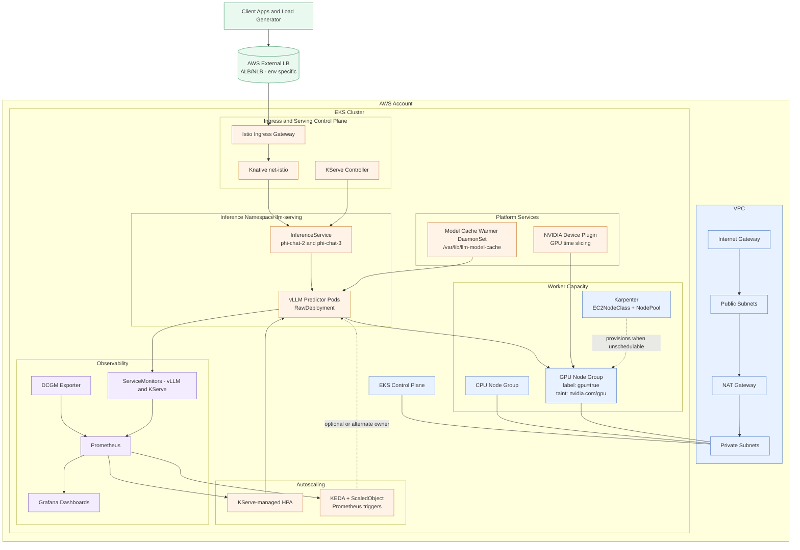

# Platform Architecture Diagram

Use this Mermaid source directly in:
- Mermaid Live Editor
- Markdown preview with Mermaid support
- Draw.io Mermaid import

## Reading Guide
- Solid arrows show primary request/data/control flow.
- Dashed arrows show conditional behavior (for example Karpenter expansion or optional KEDA ownership).
