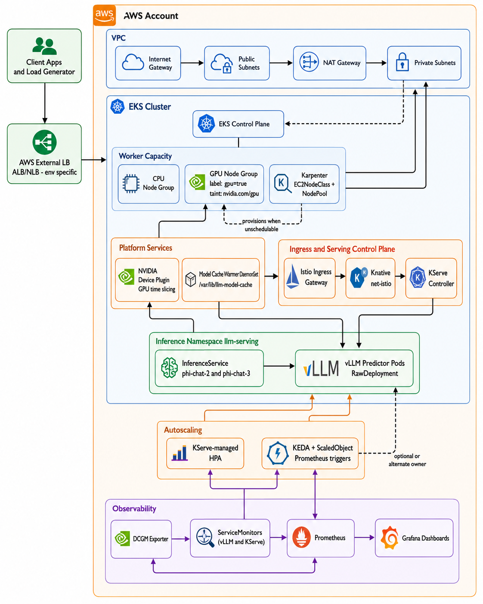

# Platform Architecture

## Context
This document captures the implemented architecture of this Kubernetes-native LLM serving platform. The platform is designed for high throughput, GPU efficiency, autoscaling, and full-stack observability using vLLM, KServe, Prometheus, and Grafana.

Primary objectives:
- Run GPU-based LLM inference on EKS using KServe + vLLM.
- Scale serving capacity with Kubernetes-native controls.
- Observe infra and inference behavior with Prometheus/Grafana.

## Diagram

- Mermaid source: [docs/architecture/platform-architecture-diagram.md](docs/architecture/platform-architecture-diagram.md)

## High-Level System
The platform is composed of:
- AWS network and EKS foundation provisioned with Terraform.
- GPU-capable worker capacity (managed node groups and Karpenter policy).
- Model serving layer using KServe RawDeployment with vLLM containers.
- Service mesh and ingress path with Istio + Knative net-istio.
- Autoscaling controls using single-owner policy with KEDA ownership for `phi-chat-2`.
- Observability stack using kube-prometheus-stack, DCGM exporter, and ServiceMonitors.
- Benchmark harness for repeatable latency/throughput measurements.

## Component Breakdown

### 1. AWS Infrastructure Layer
Implemented via Terraform environment and modules:
- VPC with public/private subnets and NAT routing.
- EKS control plane with private endpoint mode configurable.
- Core EKS add-ons: VPC CNI, CoreDNS, kube-proxy, EBS CSI.

Operational intent:
- Keep worker nodes in private subnets.
- Use managed networking and IAM/OIDC integration for cluster services.

### 2. Compute and GPU Scheduling Layer
Two capacity patterns are defined:
- Managed node groups:
  - CPU node group for general workloads.
  - GPU node group for inference workloads with taints/labels.
- Karpenter:
  - Controller + NodePool/EC2NodeClass definitions for GPU expansion policy.

GPU enablement:
- NVIDIA device plugin deployed via Helm.
- Time-slicing configuration enabled through plugin config map values.

### 3. Model Cache Layer
Node-local model cache strategy:
- DaemonSet warms model artifacts to host path on GPU nodes.
- Serving pods mount host cache at /models.

Result:
- Reduced cold-start pull/download overhead.
- Consistent model pathing for phi-2, phi-3, and TinyLlama manifests.

### 4. Serving and Routing Layer
Serving stack:
- KServe InferenceService manifests (RawDeployment mode).
- vLLM OpenAI-compatible runtime container.
- Istio + Knative net-istio for ingress routing.

Traffic path in this repo:
1. Client calls external endpoint.
2. Cloud load balancer fronts Istio ingress gateway service.
3. Istio/Knative routes to KServe predictor service.
4. Predictor pod serves request via vLLM.

Notes on load balancer:
- The runbook uses ALB-style external testing examples.
- Terraform in this repository installs Istio ingress and KServe components; external load balancer provisioning can be environment-specific.

### 5. Autoscaling Layer
Implemented in this repository:
- KServe InferenceService in RawDeployment mode with external autoscaler annotation for `phi-chat-2`.
- KEDA ScaledObject manages autoscaling for `phi-chat-2-predictor` based on Prometheus signals.

Current architecture decision (documented):
- Keep one autoscaling owner per predictor deployment.
- For `phi-chat-2`, use KEDA as the autoscaling owner and keep KServe HPA disabled via `serving.kserve.io/autoscalerClass: external`.
- Reference: docs/architecture/autoscaling-decision-record.md.

### 6. Observability Layer
Cluster observability:
- kube-prometheus-stack (Prometheus Operator + Grafana).
- Metrics Server and DCGM exporter.
- Custom GPU recording/alert PrometheusRule objects.

Serving observability:
- ServiceMonitor for vLLM standalone service.
- ServiceMonitor for KServe phi-chat services.
- Dashboards for GPU, latency, and inference metrics.

### 7. Benchmark and Validation Layer
Benchmark orchestration:
- Scripted llm-perf-style runner with profile sweeps.
- CSV outputs for throughput, TTFT, and latency curves.

Phase status alignment:
- Architecture and dashboard work are complete for the Phase 7 scope.
- Benchmark report completion remains the final evidence artifact.

## Reference Paths (Implemented Sources)
- Terraform environment entrypoint:
  - terraform/envs/dev/main.tf
- Core Terraform modules:
  - terraform/modules/networking
  - terraform/modules/eks
  - terraform/modules/nodegroups
  - terraform/modules/karpentar
  - terraform/modules/kserve
  - terraform/modules/observability
  - terraform/modules/nvidia-device-plugin
  - terraform/modules/keda
- Kubernetes manifests:
  - kubernetes/base/namespaces
  - kubernetes/base/storage
  - kubernetes/base/monitoring
  - kubernetes/serving/kserve
  - kubernetes/serving/vllm
  - kubernetes/autoscaling
- Operations and evidence docs:
  - docs/runbooks
  - docs/architecture/autoscaling-decision-record.md
  - docs/benchmarks/vllm-benchmark-report.md

## Architecture Decisions Captured
- KServe is the serving control plane for InferenceService workloads.
- Istio/Knative ingress path is the routing backbone.
- GPU scheduling combines taints/labels + NVIDIA plugin + optional Karpenter expansion.
- Prometheus is the metric source for both observability and autoscaling signals.
- Keep exactly one autoscaling owner per predictor deployment to avoid HPA conflicts.

## What This Architecture Optimizes For
- Predictable GPU scheduling behavior.
- Clear separation between infra, serving, autoscaling, and observability concerns.
- Reproducible load/perf measurement workflow.
